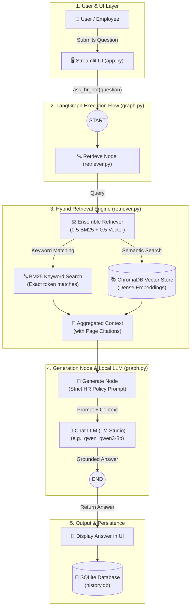
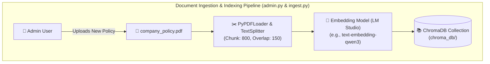

# 🏢 HR Policy Assistant (HRBotPolicy)

An intelligent HR Policy Q&A assistant built with **LangGraph**, **LangChain**, **Streamlit**, and **LM Studio**. It enables employees to query company HR policies and receive accurate, context-grounded answers powered by a hybrid retrieval pipeline (**ChromaDB Vector Search + BM25 Keyword Search**).

---

## ✨ Features

- **Hybrid Retrieval (Vector + BM25)**: Combines semantic dense retrieval (via ChromaDB) and keyword/sparse retrieval (via BM25) through an `EnsembleRetriever` for accurate context extraction.
- **Agentic Workflow with LangGraph**: Clean state graph (`START -> retrieve -> generate -> END`) orchestrating retrieval and response generation.
- **Hallucination Prevention**: Strict system prompt instructing the model to answer *only* using retrieved context with page citations, or redirect to the HR department if the information is unavailable.
- **Local & Private LLM Inference**: Works out-of-the-box with local models via LM Studio (OpenAI-compatible API endpoint).
- **Streamlit User Interface**:
  - Clean question-and-answer workspace.
  - Interactive sidebar history with SQLite persistence.
  - Ability to review past queries and answers or delete them.
- **Admin Management Portal (`admin.py`)**:
  - Password-protected access.
  - View current active policy document and metadata.
  - Upload new policy PDF documents (automatically wipes previous index and re-chunks).
  - Manual re-indexing utility.

---

## 🏗️ Architecture





---

## 📁 Project Structure

```text
HrPolicyBot/
├── .env                  # Environment variables and LM Studio configuration
├── app.py                # User-facing Streamlit application with chat & history
├── admin.py              # Admin Streamlit portal for document upload & re-indexing
├── config.py             # Global configurations, file paths, model names, weights
├── database.py           # SQLite database handlers for query/answer history
├── graph.py              # LangGraph state graph and prompt execution pipeline
├── ingest.py             # PDF text loading, chunking, and ChromaDB indexing logic
├── retriever.py          # Hybrid retriever setup (BM25 + Chroma vector search)
├── data/
│   └── company_policy.pdf# Active HR policy document
├── chroma_db/            # ChromaDB persistent vector storage
├── history.db            # SQLite database storing query history
├── pyproject.toml        # Project dependencies and packaging configuration
└── uv.lock               # uv dependency lockfile
```

---

## ⚙️ Prerequisites

1. **Python 3.13+**
2. **[uv](https://github.com/astral-sh/uv)** (recommended fast Python package manager) or standard `pip`
3. **[LM Studio](https://lmstudio.ai/)** running locally:
   - Ensure the local server is started (default: `http://localhost:1234/v1`).
   - Load an instruction chat model (e.g., `qwen2.5-7b-instruct` or `qwen_qwen3-8b`).
   - Load an embedding model (e.g., `text-embedding-nomic-embed-text-v1.5` or `text-embedding-qwen3-embedding-0.6b`).

---

## 🚀 Installation & Setup

### 1. Clone the repository
```bash
git clone <repository-url>
cd HrPolicyBot
```

### 2. Install dependencies
Using `uv`:
```bash
uv sync
```
Or with standard pip:
```bash
pip install -r pyproject.toml
```

### 3. Configure Environment Variables
Create or inspect your `.env` file in the project root:

```env
# LM Studio (OpenAI-compatible server)
LM_STUDIO_BASE_URL=http://localhost:1234/v1
LM_STUDIO_API_KEY=lm-studio

# Model identifiers matching what you have loaded in LM Studio
CHAT_MODEL=qwen_qwen3-8b
EMBEDDING_MODEL=text-embedding-qwen3-embedding-0.6b

# Admin Portal Password (leave blank to disable password protection)
ADMIN_PASSWORD=admin123
```

---

## 🖥️ Running the Application

### 1. User Application (HR Assistant)
Launch the employee-facing assistant:
```bash
uv run streamlit run app.py
```
Access the application in your browser at `http://localhost:8501`.

### 2. Admin Portal
In a separate terminal, launch the admin dashboard on a different port:
```bash
uv run streamlit run admin.py --server.port 8502
```
Access the admin portal at `http://localhost:8502`.

---

## 📖 Usage Guide

1. **Ask Questions**:
   - Type your question into the input field (e.g., *"What is the policy on maternity leave?"* or *"How many casual leaves am I entitled to?"*).
   - The bot retrieves relevant passages from the HR PDF and responds with concise, sourced answers (including page numbers).
2. **Query History**:
   - Previous questions are listed in the left sidebar.
   - Click any past query to review the saved question and answer.
   - Delete past queries with the **✕** button.
3. **Updating the Policy Document**:
   - Navigate to the Admin Portal (`http://localhost:8502`).
   - Enter your `ADMIN_PASSWORD`.
   - Upload a new PDF file and click **Upload & Index**. The system automatically chunks the text, clears old embeddings, and rebuilds the vector index.

---

## 🔧 Tuning Parameters

You can adjust chunking and retrieval parameters directly in [`config.py`](config.py):

| Parameter | Default | Description |
| :--- | :--- | :--- |
| `CHUNK_SIZE` | `800` | Chunk size in characters for `RecursiveCharacterTextSplitter` |
| `CHUNK_OVERLAP` | `150` | Overlap between consecutive text chunks |
| `TOP_K` | `4` | Number of documents retrieved by each retriever |
| `BM25_WEIGHT` | `0.5` | Weight assigned to keyword matching in ensemble retrieval |
| `VECTOR_WEIGHT`| `0.5` | Weight assigned to semantic vector search in ensemble retrieval |
